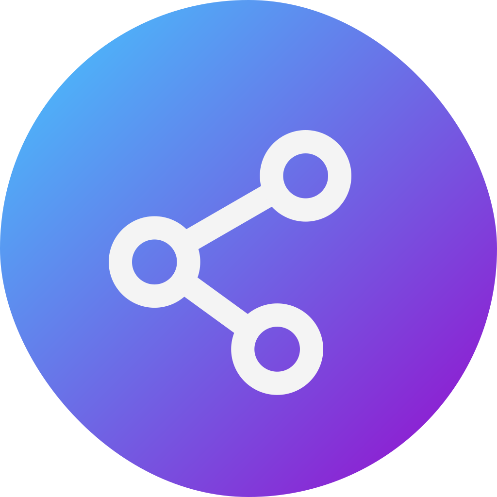

<p align="center">
  
</p>

<h1 align="center">I Show You</h1>
<p align="center">A self-hosted web application for data presentation and sharing</p>
<p align="center">English | <a href="README.zh-CN.md">中文</a></p>

- [Introduction](#introduction)
- [Demo](#demo)
- [Screenshot](#screenshot)
- [Quick Start](#quick-start)
- [Documentation](#documentation)
- [Troubleshooting](#troubleshooting)
  - [Your device may not support editing](#your-device-may-not-support-editing)
  - [Words will be missed when inputting Chinese on PC](#words-will-be-missed-when-inputting-chinese-on-pc)
- [Development Setup](#development-setup)
  - [Prerequisites](#prerequisites)
  - [Setting Up](#setting-up)
- [License](#license)

## Introduction

This is a web application for sharing text, code ~~and other data~~, similar to Gist.

- **🍺 Reasonable Feature**

  Designed for modern browsers, it supports features such as multi-tab page switching, code highlighting, file preview, history, automatic saving, and automatic update of file content.

- **🎨 Nice interface**

  Pay attention to details, using IBM's Carbon design system, while adapting to the mobile interface.

- **🚀 Self-hosted and custom configuration**

  Use Docker Compose for deployment and unified management. You only need to write a configuration file according to the document to run, and provide some customization options.

The application uses React / TypeScript and Echo / Golang. The database uses MongoDB. IE 11 and other outdated browsers are not supported.

**The application is in the testing stage, and the data structure and API design may change. Please do not store important data.**

## Demo

The application is currently under development, and the data may be cleared at any time.

See https://i-show-you.dev.lifeni.life .

## Screenshot

<details>
  <summary>Homepage</summary>


</details>

<details>
  <summary>Document editing page</summary>


</details>

<details>
  <summary>File sharing page</summary>


</details>

<details>
  <summary>File settings</summary>


</details>

<details>
  <summary>File history</summary>


</details>

<details>
  <summary>Confirmation of deleting files</summary>


</details>

<details>
  <summary>File preview</summary>


</details>

<details>
  <summary>Login admin page</summary>


</details>

<details>
  <summary>Admin page</summary>


</details>

## Quick Start

It is recommended to use Docker Compose for deployment.

Before performing the following steps, please make sure that the newer Docker and Docker Compose are installed on the machine. Currently the image only supports the amd64 version of Linux. The main program running occupies less than 100 MB of memory, and the database occupancy is related to the amount of data, so please reserve at least 200 MB of memory for the entire application.

1. Download the [docker-compose.yml](https://github.com/Lifeni/i-show-you/blob/master/build/docker-compose.yml) file in the repo to your own machine. It is best to create a separate `folder` and put the files in it.

   <details>
     <summary>docker-compose.yml</summary>

   ```yml
   version: '3'

   services:
     mongo:
       image: mongo:latest
       container_name: i-show-you-mongo
       restart: always
       # ports:
       #   - 27017:27017
       volumes:
         - data:/data/db
       networks:
         - network

     app:
       image: lifeni/i-show-you:latest
       container_name: i-show-you-app
       restart: always
       ports:
         - 8080:8080
       volumes:
         - ./configs:/app/configs
       networks:
         - network
       depends_on:
         - mongo

   volumes:
     data:

   networks:
     network:
   ```

   </details>

2. Create a new [main.yml](https://github.com/Lifeni/i-show-you/blob/master/configs/main.yml) file and place it in the `folder/configs/main.yml`, The content is as follows.

   <details>
     <summary>main.yml and field description</summary>

   ```yml
   database:
     host: mongo
     port: 27017

   app:
     history:
       enable: true
       save_period: 60

     admin:
       enable: true
       try_count: 3
       ban_period: 120

   secret:
     jwt_key:
       file: # your_file_key
       admin: # your_admin_key

     admin: # your_admin_password
   ```

   By default, only three configurations in secret need to be added:

   - `jwt_key.file` is used to encrypt the JWT key of the file owner
   - `jwt_key.admin` is used to encrypt the JWT key of the administrator page
   - `admin` administrator page login password

   </details>

   For detailed configuration, please refer to the document [Configuration | I Show You](https://lifeni.github.io/i-show-you/config/).

3. Execute the following command under the `folder` to start the container.

   ```shell
   docker-compose up -d
   ```

   The `-d` command stands for background execution, and you can view real-time output if you remove it.

4. Open [http://localhost:8080](http://localhost:8080) or use Nginx reverse proxy port 8080 to view the front-end page.
   
   > Note: The application exposes port 8080 by default. If there is a port conflict or you want to use your own MongoDB, you can modify the yml file by yourself.

## Documentation

The documentation is being written. (Currently only available in Chinese)

See https://lifeni.github.io/i-show-you .

## Troubleshooting

### Your device may not support editing

The application uses [Monaco Editor](https://microsoft.github.io/monaco-editor/) as the editor, and this editor currently does not support mobile browser and mobile frameworks. If you still want to edit, there may be problems such as failure to delete and text loss.

For more information about Monaco Editor, you can view [microsoft/monaco-editor: A browser based code editor](https://github.com/Microsoft/monaco-editor#monaco-editor).

### Words will be missed when inputting Chinese on PC

If you are using QQ Pinyin input method, this problem may occur. Switch to Sogou input method or Microsoft input method to solve it.

## Development Setup

### Prerequisites

| Type      | Prerequisites  |
| --------- | -------------- |
| Front-end | Node 14+, Yarn |
| Back-end  | Go 1.15+       |
| Database  | MongoDB        |
| Optional  | Nginx, Docker  |

The application uses Echo (Golang framework) to host front-end files (port 8080). By default (production), the generated static files need to be placed in the /public directory of the /server folder, but this is not suitable for the development environment because of the development of React server uses port 3000 by default instead of generating static files.

Therefore, during development, it is recommended to use Nginx as a reverse proxy server, proxy the `/` path to `/` on port 3000, proxy the `/api` path to `/api` on port 8080, and then set `/websocket` Route proxy to `/websocket` on port 8080, bypassing Echo hosting. The [nginx.conf](configs/nginx.conf) I used can be found in the /configs folder of the project. It hosts port 80 by default and is for reference only.

In addition, under the development environment, you need to start a MongoDB by yourself. Here, Docker is recommended for installation.

```shell
docker run -d -p 27017:27017 mongo
```

### Setting Up

1. Clone the project and enter the project folder.

   ```shell
   git clone https://github.com/Lifeni/i-show-you.git
   cd i-show-you
   ```

2. Install front-end dependencies.

   ```shell
   cd webapp
   yarn
   ```

3. After configuring Nginx and MongoDB, run the Go program.

   ```shell
   cd ../server
   go run .
   ```

   Don’t forget the dot at the end of the command. If it can run normally, there will be an Echo character drawing Logo and the words `Connected to database`. Then open the address set in the Nginx configuration (if you use the configuration file I provided, the default address is http://localhost, which is the local port 80).

## License

MIT License
